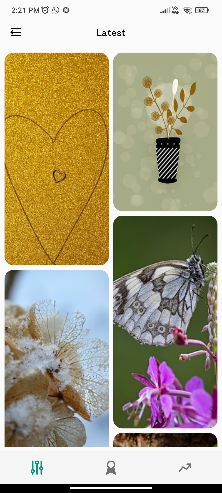
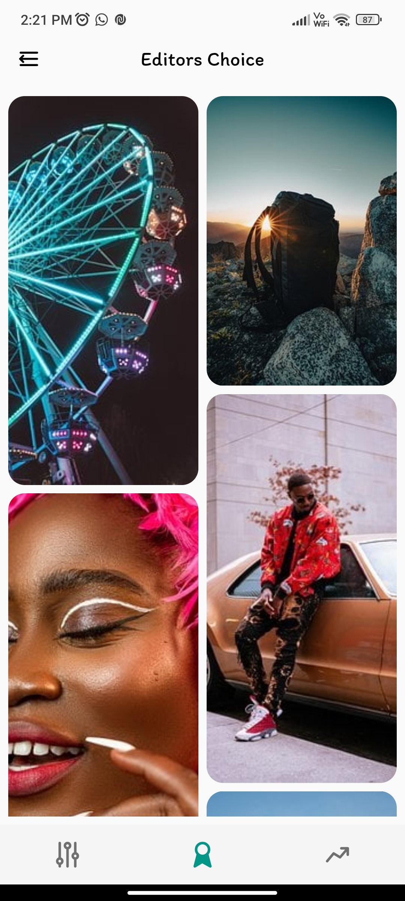
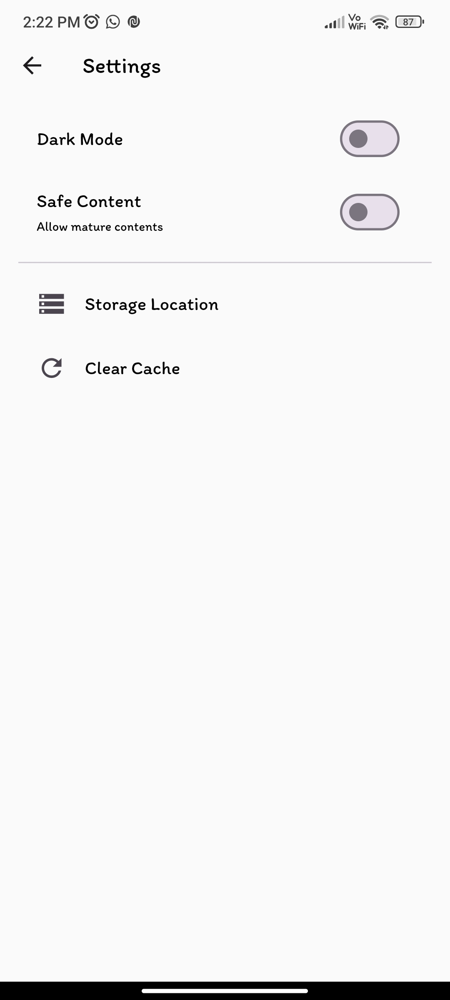
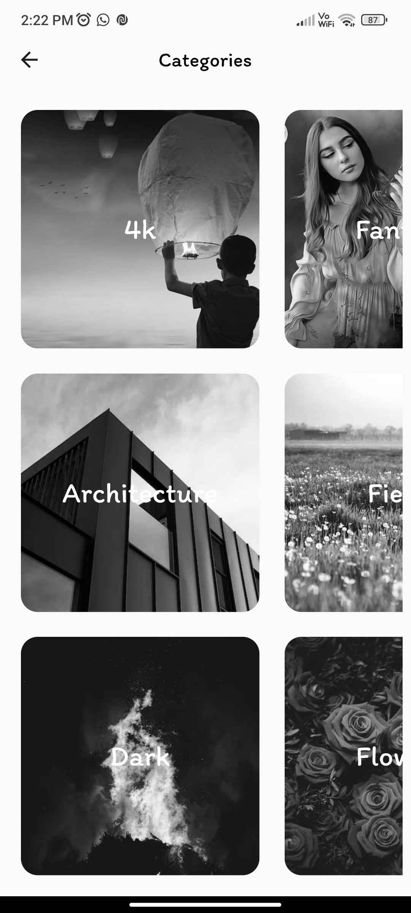
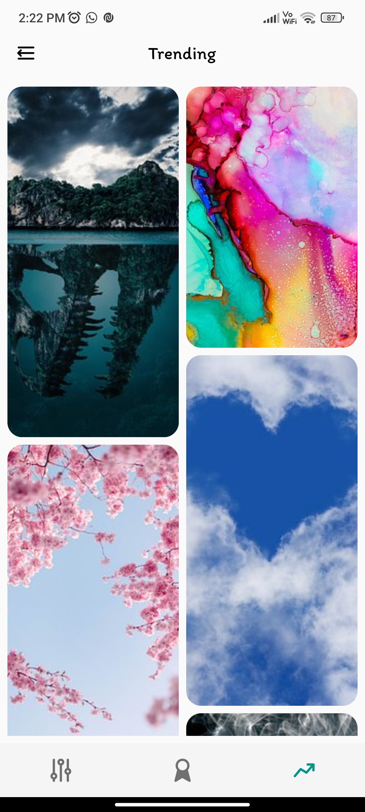

# Walli Verse 
Welcome to the ```Walli Verse```, your go-to destination for stunning wallpapers powered by the ```Pixabay API```. This app combines the beauty of Flutter's sleek and responsive design with the vast library of high-quality images available on Pixabay, providing users with a seamless and visually appealing wallpaper experience. Whether you're looking to refresh your device's background or explore a world of captivating visuals, Walli Verse has you covered. Explore, customize, and elevate your device's aesthetics with ease. Let's dive into a world of endless possibilities with the Walli Verse!

### **Discover the Best Features of the Walli Verse**

1. **Wide Selection of Wallpapers:** Explore an extensive collection of high-quality wallpapers sourced from Pixabay's vast database, ensuring you find the perfect backdrop for your device.

2. **20+ Categories:** Dive into a world of inspiration with over 20 carefully curated categories, making it easy to discover wallpapers tailored to your unique tastes.

3. **Unlimited Downloads:** Download an unlimited number of stunning images to personalize your device to your heart's content, without any restrictions.

4. **Favorite Wallpapers with Ease:** Simply double-tap on any image to mark it as a favorite. Create your personalized gallery of go-to backgrounds for quick and easy access.

5. **Light/Dark Theme:** Customize your app experience with the option to switch between light and dark themes, ensuring comfortable viewing in any lighting condition.

6. **Easy to Use:** Walli Verse user-friendly interface ensures that browsing, searching, and setting wallpapers is a straightforward and enjoyable experience for users of all levels of expertise.

7. **Responsive UI:** Enjoy a seamless and responsive user interface that adapts to your device, providing an optimal viewing experience on screens of all sizes.

8. **Open Source:** Walli Verse is open source, inviting developers and enthusiasts to contribute, modify, or enhance the app as part of the vibrant open-source community.

Elevate your device's aesthetics and explore a world of beautiful wallpapers with the feature-rich Walli Verse.

### **Future prospective**
1. Add more categories.
2. Directly search functionality.


# How To Run The Project
## just copy your pixabay api key .env file

### 🎨 **Welcome to Walli Verse - Unleash Your Creativity!** 🎨

Are you passionate about Flutter and mobile app development? Do you have a flair for design, a knack for coding, or simply a love for beautiful wallpapers? Join us in shaping the future of mobile wallpapers with Walli Verse, the open-source Flutter wallpaper app!

## Don't forget to Leave a ⭐ 

## ScreenShots





